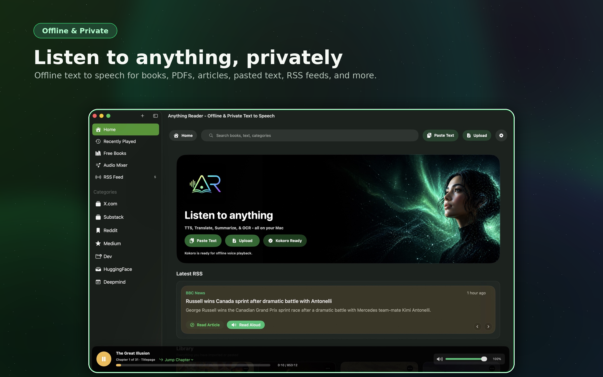

# Anything Reader

Anything Reader is a local-first macOS app for turning documents, pasted text, RSS items, and browser clips into a persistent reading and listening library.

This repository is structured as a SwiftUI app shell plus focused services for ingest, playback, text normalization, speech synthesis, free-book browsing, audio mixing, and RSS sync.

## What The App Does

- Imports PDF, ePub, TXT, HTML, and image files
- Accepts pasted text and browser clips
- Normalizes extracted text and stores it locally for replay
- Synthesizes speech with Kokoro or Moonshine
- Persists reading progress and chapter/page jump targets
- Exports generated audio files for offline playback
- Browses a local free-books catalog backed by SQLite
- Refreshes RSS feeds and supports read-aloud from article text
- Plays background audio tracks that can follow reader playback
- Checks for app updates from a remote version payload
- Registers itself to launch at login on first install

## App Architecture

### Main Shell

- [Anything_ReaderApp.swift](Anything%20Reader/Anything%20Reader/Anything_ReaderApp.swift) creates the SwiftData container and launches `ContentView`.
- [ContentView.swift](Anything%20Reader/Anything%20Reader/ContentView.swift) is the orchestration layer for the main navigation split view, reader controls, import flows, playback flows, and modal presentation.
- [ReaderAppShellViews.swift](Anything%20Reader/Anything%20Reader/ReaderAppShellViews.swift) contains small shell-level views such as the background, update banner, and home drop overlay.

### Shared UI

- [ReaderTypes.swift](Anything%20Reader/ReaderTypes.swift) defines the sidebar selection, appearance mode, playback state, and style helpers.
- [ReaderComponents.swift](Anything%20Reader/ReaderComponents.swift) contains reusable SwiftUI components used across the reader shell.
- [ReaderSheets.swift](Anything%20Reader/ReaderSheets.swift) contains the modal sheets for settings, import options, TTS download, and related workflows.

### Import And Reading

- [DocumentIngestService.swift](Anything%20Reader/Anything%20Reader/DocumentIngestService.swift) extracts text from PDFs, ePub files, TXT/HTML files, and images, then normalizes it.
- [DocumentTranslationService.swift](Anything%20Reader/Anything%20Reader/DocumentTranslationService.swift) handles translation when the user opts into translated import.
- [FileSummarizationService.swift](Anything%20Reader/Anything%20Reader/FileSummarizationService.swift) creates summaries during import when requested.
- [TextNormalizationService.swift](Anything%20Reader/Anything%20Reader/TextNormalizationService.swift) cleans and normalizes extracted text before it is saved.
- [ReaderPlaybackChunkService.swift](Anything%20Reader/Anything%20Reader/ReaderPlaybackChunkService.swift) turns text into playback chunks and resume targets.
- [ReaderPlaybackSupport.swift](Anything%20Reader/Anything%20Reader/ReaderPlaybackSupport.swift) contains pure playback math and reading-position formatting helpers.
- [PhonemeCacheService.swift](Anything%20Reader/Anything%20Reader/PhonemeCacheService.swift) stores phoneme data so repeated narration is faster.

### Speech And Playback

- [ReaderTTSModels.swift](Anything%20Reader/Anything%20Reader/ReaderTTSModels.swift) manages the selected TTS provider, available voices, and provider availability.
- [KokoroModelStore.swift](Anything%20Reader/Anything%20Reader/KokoroModelStore.swift) tracks Kokoro model installation and download state.
- [MoonshineModelStore.swift](Anything%20Reader/Anything%20Reader/MoonshineModelStore.swift) tracks Moonshine model installation and download state.
- [KokoroSpeechService.swift](Anything%20Reader/Anything%20Reader/KokoroSpeechService.swift) bridges the Kokoro runtime.
- [MoonshineSpeechService.swift](Anything%20Reader/Anything%20Reader/MoonshineSpeechService.swift) bridges the Moonshine runtime.
- [ReaderPlaybackService.swift](Anything%20Reader/Anything%20Reader/ReaderPlaybackService.swift) drives chunked narration playback for library entries.
- [GeneratedAudioPlaybackService.swift](Anything%20Reader/Anything%20Reader/GeneratedAudioPlaybackService.swift) plays exported audio files independently from live narration.
- [ReaderPlaybackAudioCacheService.swift](Anything%20Reader/Anything%20Reader/ReaderPlaybackAudioCacheService.swift) caches synthesized audio chunks for faster replay.
- [ReaderPlaybackEventCenter.swift](Anything%20Reader/Anything%20Reader/ReaderPlaybackEventCenter.swift) broadcasts reader and generated-audio playback state changes.
- [ReaderVolumeControlView.swift](Anything%20Reader/Anything%20Reader/ReaderVolumeControlView.swift) provides the shared volume control UI.

### Library Features

- [FreeBooksView.swift](Anything%20Reader/Anything%20Reader/FreeBooksView.swift) browses the free-books catalog and supports downloads.
- [FreeBooksCatalogStore.swift](Anything%20Reader/Anything%20Reader/FreeBooksCatalogStore.swift) manages the local SQLite catalog and search/filter state.
- [FreeBooksSQLiteHelpers.swift](Anything%20Reader/Anything%20Reader/FreeBooksSQLiteHelpers.swift) contains SQLite helpers for the catalog.
- [FreeBookDownloadOptionsSheet.swift](Anything%20Reader/Anything%20Reader/FreeBookDownloadOptionsSheet.swift) asks whether a book should be translated before import.
- [FreeBookDownloadSuccessSheet.swift](Anything%20Reader/Anything%20Reader/FreeBookDownloadSuccessSheet.swift) confirms successful downloads.
- [FreeBookHTMLViewerView.swift](Anything%20Reader/Anything%20Reader/FreeBookHTMLViewerView.swift) displays HTML book content.
- [FreeBookWebView.swift](Anything%20Reader/Anything%20Reader/FreeBookWebView.swift) wraps the web view used by the catalog UI.
- [FreeBookCardView.swift](Anything%20Reader/Anything%20Reader/FreeBookCardView.swift) renders individual catalog cards.
- [FreeBookCategoryFilter.swift](Anything%20Reader/Anything%20Reader/FreeBookCategoryFilter.swift) defines catalog filter categories.
- [FreeBookCoverArtCacheService.swift](Anything%20Reader/Anything%20Reader/FreeBookCoverArtCacheService.swift) caches catalog art.

### RSS And Browser

- [RSSFeedsView.swift](Anything%20Reader/Anything%20Reader/RSSFeedsView.swift) manages feed subscriptions and item browsing.
- [RSSFeedRefreshService.swift](Anything%20Reader/Anything%20Reader/RSSFeedRefreshService.swift) refreshes subscriptions and maintains unread counts.
- [RSSFeedSQLiteStore.swift](Anything%20Reader/Anything%20Reader/RSSFeedSQLiteStore.swift) persists RSS subscription data and feed items.
- [RSSArticleScraperService.swift](Anything%20Reader/Anything%20Reader/RSSArticleScraperService.swift) scrapes article text for read-aloud imports.
- [RSSPushNotificationService.swift](Anything%20Reader/Anything%20Reader/RSSPushNotificationService.swift) checks notification capability and drives the permission prompt.
- [BrowserNativeMessagingService.swift](Anything%20Reader/Anything%20Reader/BrowserNativeMessagingService.swift) installs the native messaging host and reads browser clip messages.

### Audio Mixer

- [AudioMixerViews.swift](Anything%20Reader/Anything%20Reader/AudioMixerViews.swift) renders the mixer screen and track cards.
- [AudioMixerLibraryService.swift](Anything%20Reader/Anything%20Reader/AudioMixerLibraryService.swift) manages mixer library tracks.
- [AudioMixerPlaybackService.swift](Anything%20Reader/Anything%20Reader/AudioMixerPlaybackService.swift) controls background audio playback and follow-reader behavior.

### Miscellaneous Services

- [CoverArtService.swift](Anything%20Reader/Anything%20Reader/CoverArtService.swift) generates cover art for imported books.
- [AppUpdateChecker.swift](Anything%20Reader/Anything%20Reader/AppUpdateChecker.swift) checks remote version metadata and surfaces update banners/dialogs.
- [StartupLaunchService.swift](Anything%20Reader/Anything%20Reader/StartupLaunchService.swift) registers the app to launch at login on first install.
- [KokoroG2PService.swift](Anything%20Reader/KokoroG2PService.swift) provides phoneme conversion support for Kokoro.

## Feature Flow

### Import And Playback

1. The user imports a file, pastes text, drops a file, or sends browser content.
2. `ContentView` stages the source locally.
3. `DocumentIngestService` extracts text and reading metadata.
4. The text is normalized and saved into the Application Support upload directory.
5. `LibraryEntry` stores the file paths, progress, reading structure, counts, and generated metadata.
6. `ReaderPlaybackService` splits the text into chunks and synthesizes audio on demand.
7. `PhonemeCacheService` and `ReaderPlaybackAudioCacheService` reduce repeat work.
8. Progress is persisted so playback can resume later from the same reading position.

### Generated Audio

1. The user requests audio export from an imported library item.
2. `LibraryAudioGenerationService` renders a local audio file using the selected TTS voice.
3. `GeneratedAudioPlaybackService` plays the rendered file independently from live narration.
4. The resulting file path, duration, and last playback position are stored on `LibraryEntry`.

### Free Books

1. The user opens the Free Books section.
2. `FreeBooksCatalogStore` loads or refreshes the local SQLite catalog.
3. Books can be filtered by language and category.
4. Downloads can optionally be translated before import into the local library.

### RSS

1. The user adds RSS feeds in the RSS section.
2. `RSSFeedRefreshService` keeps subscriptions refreshed while the app is open.
3. Feed items can be opened externally or passed through the read-aloud import pipeline.
4. Notification permission can be requested when needed.

### Audio Mixer

1. The user opens the Audio Mixer section.
2. Bundled tracks or imported audio files are managed by the mixer library service.
3. Playback can follow reader narration and optionally loop.

## Data And Storage

- SwiftData uses a persistent store at `~/Library/Application Support/Anything Reader/AnythingReader-v7.sqlite`.
- If the persistent store cannot be opened, the app falls back to an in-memory container so launch still succeeds.
- Imported source files are staged under `~/Library/Application Support/Anything Reader/Uploaded Files/`.
- Browser-native messaging uses an inbox directory under the same Application Support tree.
- `LibraryEntry` persists derived reading metadata directly on the model:
  - `pageCount`
  - `chapterCount`
  - `sectionCount`
  - `readingStructureKind`
  - `readingJumpTargets`
  - generated-audio metadata
  - summary metadata
  - playback progress and resume fields

### Persistence & Notifications

- The main SwiftData store holds the app library, categories, and audio mixer records.
- `LibraryEntry`, `ReaderCategory`, and `AudioMixerTrackRecord` all live in that same SwiftData database.
- Free Books uses a separate downloaded SQLite catalog file, not the SwiftData store.
- RSS uses its own SQLite store for feed subscriptions, refresh state, and item records.
- RSS notifications are local macOS notifications scheduled from refreshed feed items.
- Notification permission is checked and requested through `RSSPushNotificationService`.
- Tapping an RSS notification returns the app to the RSS section by writing the pending sidebar selection and posting a navigation notification.

## Development Notes

- Build the app in Xcode after any significant flow change.
- Keep changes scoped to the feature you are touching.
- Prefer extracting pure helpers and reusable views before moving stateful orchestration.
- `ContentView` is still the main app coordinator. It is acceptable for it to remain a large file if the current work is cross-cutting.
- If you change import, playback, or storage behavior, verify the app still launches, imports, plays back, and resumes correctly.
- Keep new files focused and small. The codebase already favors one responsibility per file.

## Minimum Requirements

- macOS 15 or later
- Xcode 16 or later
- Local disk space for imported documents, cached audio chunks, and downloaded model files

## References

- App launch entry: [Anything_ReaderApp.swift](Anything%20Reader/Anything%20Reader/Anything_ReaderApp.swift)
- Main shell: [ContentView.swift](Anything%20Reader/Anything%20Reader/ContentView.swift)
- SwiftData models: [Item.swift](Anything%20Reader/Anything%20Reader/Item.swift)
